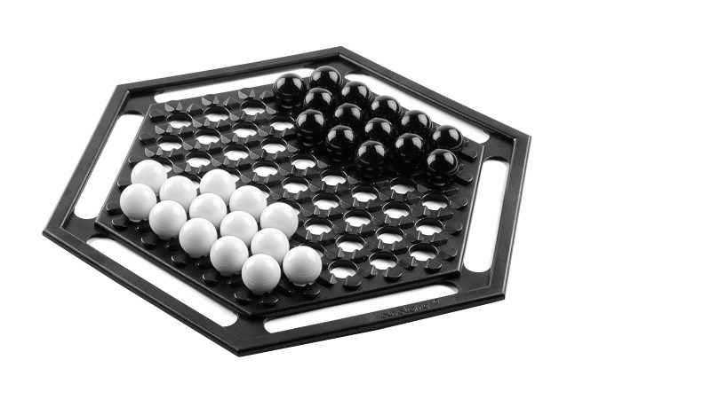

## Table of contents

<!-- TOC depthFrom:1 depthTo:6 withLinks:1 updateOnSave:1 orderedList:0 -->

	- [Table of contents](#table-of-contents)
	- [Abalone](#abalone)
	- [Features](#features)
	- [Anti-features](#anti-features)
	- [Requirements](#requirements)
	- [Alternatives](#alternatives)
	- [Tools & Technologies](#tools-technologies)
	- [Design Approach](#design-approach)
	- [References](#references)
	- [[Rules](http://www.gamerz.net/pbmserv/abalone.html)](#ruleshttpwwwgamerznetpbmservabalonehtml)
	- [Screenshot](#screenshot)
	- [Development](#development)
		- [Initial concept](#initial-concept)
	- [Credits](#credits)
	- [Next steps for further iterations](#next-steps-for-further-iterations)

<!-- /TOC -->

## Abalone

A playable, in-browser version of the strategy game [Abalone](https://en.wikipedia.org/wiki/Abalone_(board_game)).  

Abalone is a challenging game of strategy that for two players. Each take turns moving marbles around the board, with the objective to remove other player's marbles.  

[Deployed on firebase for multi-player enjoyment using firebase dB.](https://abalone-game.firebaseapp.com/)  
You can play with anyone online if you both visit the hosted version on firebase, since it has a firebase dB backend.  

## Features

+ Functions just like the board game, with lateral moves of strings of marbles.

## Anti-features
The game does not include the following features, but pull requests are welcome.

+ Countdown timer
+ AI

## Requirements
None.

## Alternatives

+ http://www.clickhere.nl/abalone/play/

## Tools & Technologies
+ javascript
+ jquery
+ fontawesome
+ firebase
+ pivotal tracker

## Design Approach

Since Abalone is a relatively little-known game, user experience is foremost. Rather than showing all moves and alerting the user when they pick an invalid move, the UI only shows arrows for possible move directions. In addition, arrows turn red when you are interacting with opponent marbles for further user education.

Another facet of the user experience design is the highlighted marbles to show valid next selections. For users who are unfamiliar with the rules of Abalone, this helps to educate them on how many of their own marbles they can select to move.

## References

+ http://entertainment.howstuffworks.com/leisure/brain-games/abalone2.htm
+ http://www.cs.nott.ac.uk/~pszeo/docs/publications/ABLA_id136final.pdf

## [Rules](http://www.gamerz.net/pbmserv/abalone.html)

## Screenshot

## Development
To develop this game, I wrote user stories on [Pivotal Tracker.](https://www.pivotaltracker.com/n/projects/1487676)

### Initial concept

## Credits
Thanks to these developers for their contributions.

+ [jim](https://github.com/jim-clark)
+ [kyle](https://github.com/kylefberg)
+ [adrian](https://github.com/ishmaru)
+ [ezra](https://github.com/earnagram)
+ [phil](https://github.com/h4w5)
+ [havenwood](https://github.com/havenwood)
+ [rob](https://github.com/robawilkinson)

## Next steps for further iterations
+ Animation for moving marbles around
+ Deselect marbles
